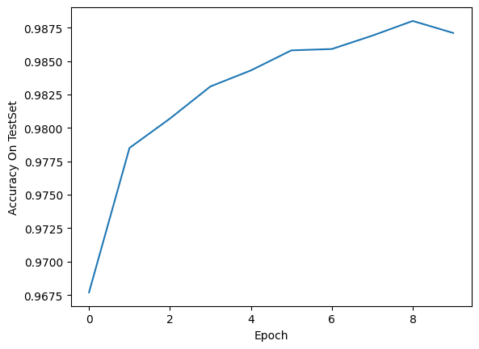
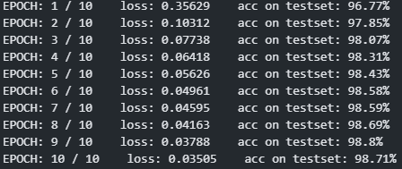
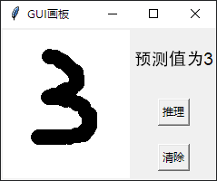

# CNN-MNIST-Demo
A CNN Demo Based on Torch and MNIST Dataset

`cnn.ipynb` is a CNN simple demo. It includes dataset loading, data preprocessing, model construction, model training, model inference, and final result output.

The neural network structure adopts two-layer `convolution -> activation function -> pooling nesting`. The accuracy in the test set can reach over 98%.

`canvas.ipynb` is a GUI program used to display the performance of a model when faced with real handwritten digit input.

`model.pth` is a pre trained network parameter file.

---

#### Accuracy On TestSet

---

#### Loss and accuracy of each EPOCH

---

#### GUI interface

